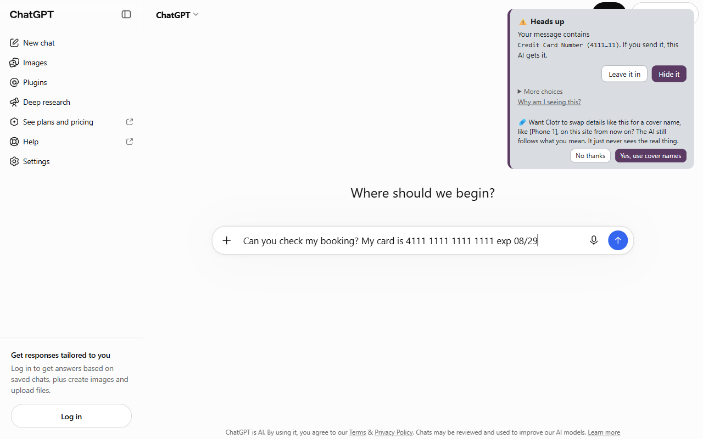

# Clotr: clot your data leaks

License: [AGPL-3.0-or-later](LICENSE) · [What changed](CHANGELOG.md)

**No AI inside. No network. No accounts. Open code. Free for people.**

**Clotr catches a password, a key or a personal detail before you send it**: in AI chats like ChatGPT, Claude,
Gemini, Copilot or Perplexity, and in your email or chat apps (Gmail, Outlook, Discord, Slack, WhatsApp and more)
once you switch them on. You decide: hide it, or send it anyway. Set it up for a parent in a few minutes, or roll it
out to a whole office.

> **A note from me.** I'm Alex, a computer science student. I caught myself telling AI chats things I'd never tell a
> stranger, and when the AI started bringing up things I'd only been thinking about, it scared me. Clotr will always
> be free for people. It runs only on your computer, never sends anything anywhere, and its code is open, so you don't
> have to take my word for it. If it misses something, or warns you about nothing, please tell me. The more you use Clotr, the more you report bugs, the better it gets. For free.
> — Alex ([BilliamBaSH](https://github.com/BilliamBaSH)) ·
> [the whole story](https://clotr.app/#who)

It is built for people who don't think of "my phone number, spelled out" as sensitive: it catches personal
details however they're written (digits, number words, misspellings, mixes), and it explains itself in plain words.

## Wherever you type something private
- **At home:** a Social Security number in a tax question, your address in an email to the landlord, the code a
  "bank" caller on the phone wants you to read out.
- **At school:** your address in a college essay, a password shared in a group project on Discord, a kid telling a
  chatbot where they live.
- **At work:** a customer's card number in an email, a patient's record number in a summary, a cloud key pasted in
  Slack.

AI chats are protected out of the box. Email and chat apps are one click each in Settings, and your browser asks
you first, for that one site.

> **Status: 1.0, the first public release.** It works in Chrome, Brave and Microsoft Edge on a computer, and in
> Firefox (see below). If it gets something wrong or misses something, please report it: that is how it gets better.

## What it catches
Everything is checked on your computer, in what you type or paste into an AI chat (or an email or chat app you
switched on), before you send it:
- **Passwords and keys:** passwords however they're phrased, API keys (OpenAI, Anthropic, GitHub, AWS, Google, Stripe,
  Slack, Hugging Face, npm and many more), tokens and session cookies in pasted `curl` commands, webhook URLs,
  connection strings, crypto wallet seed phrases and keys.
- **Personal details:** phone numbers, emails, street addresses and dates of birth, even spelled out ("nine three
  seven…"), plus answers to security questions ("my mother's maiden name is…") and door, alarm and card codes.
- **ID and money numbers:** card numbers, Social Security and ITIN, bank account numbers and IBANs, medical record
  numbers, and national IDs (UK incl. NHS, Canada, India's Aadhaar, Australia's TFN and Medicare, Spain's DNI/NIE and
  social security number, Mexico's CURP and RFC).
- **What scammers ask for:** a sign-in code texted to you, a card's security code, a remote-access code ("the AnyDesk
  code is…"), two-factor backup codes, so a message copied from a "support call" gets a second look.
- **Your own list:** your name, family, addresses, phones and employer, entered once in your *vault*. Clotr keeps only
  one-way fingerprints of them, never the details themselves.
- **Attachments:** text files, PDFs and Word, Excel and PowerPoint documents.

## What it does about it
- **Warns in the corner** by default and never stops you. You can choose, per kind of data, to be asked before
  sending instead, or to just have it counted.
- **A dashboard** in its toolbar button: what it caught, where, and what you did, with a short "this week" summary.
- **A full report** ("Your exposure report"): what each service has been told about you over time, a mind map
  of everything you could be leaking (what each service already has, what Clotr stopped, what hasn't gone anywhere
  yet, and where Clotr can't see), the riskiest moments with what to do now, and export or delete your history.
- **Setting it up for someone else**: a step-by-step page (Settings → *Set it up step by step*) for their details,
  larger warnings, a stricter setting for personal details, and a PIN so settings aren't changed by accident.
- **Notices when an AI brings up your details**: if a reply mentions your own phone number or name that you
  didn't type on that page, Clotr points it out: the AI may have it from an earlier chat or its memory.
- **Cover names while you type (Bandage)**: Clotr offers it the first time a personal detail shows up on an AI
  site. Say yes and your name, family, phone number or address becomes a label like `[Me]` or `[Phone 1]` before it
  ever reaches the AI. If the AI repeats it back, point at the label to see the real detail in
  a small bubble, or copy the whole answer with your details back in. Only your browser tab knows what the label
  means; it's on or off per AI site in Settings.
- **In English and Spanish**: warnings, the dashboard and the welcome page follow your browser's language, and
  Spanish is understood too ("mi contraseña es…", "seis cero cero…", Spanish addresses and ID numbers).
- **For teams**: IT can roll Clotr out with required settings and company watch words through the browser's
  policy ([docs/team-rollout.md](docs/team-rollout.md)). Nothing is ever reported back to anyone.
- **It tells you when it can't help**: the popup says whether Clotr can see the chat box on this page, and the toolbar
  shows a red **!** if a chat box refused Clotr's edit or a page removed its warnings.

- **On your email and chat apps too**: Settings → *Also on your email and chat apps* lists Gmail, Outlook, Yahoo
  Mail, Discord, Slack, WhatsApp, Messenger and Microsoft Teams, each off until you switch it on; on any other site,
  the toolbar button offers *Turn Clotr on here*. There the warning speaks of the people who'll read it, and Clotr
  never reads anyone else's messages (cover names and the reply check stay off).

## What's inside
**No AI inside. No network. No accounts. Open code. Free for people.**

| What's in Clotr | How you know |
|---|---|
| Plain rules you can read (`extension/patterns.js`) and hundreds of tests | They run on every change |
| No model files, no model runtime | The rule check *no AI inside: no model files or model runtimes in the extension* |
| No network: no servers, no analytics, no requests | The rule check *100% local: no network calls, no remote code* |
| AI chat sites built in; anything else only where you switch it on | The rule checks *scope: only specific https AI-site origins, never broad patterns* and *scope: everyday sites (email, chat apps) are specific https hosts and never built in* |
| No accounts | There's nothing to sign up for or log in to |

## Privacy guarantees
- **Nothing leaves your computer.** Clotr has no servers, no analytics and makes no network requests (checked
  automatically on every change).
- **It never stores what you type.** It keeps a short record of *what kind* of thing it found, on which site,
  when, and what you chose, plus a salted one-way fingerprint so it can tell "the same thing again". You can see
  every stored record in Settings → History → *See exactly what's stored*, and clear it any time.
- **It only runs where you say.** Out of the box, only on AI chat sites. Your email or a chat app, or a new AI
  tool, only after you switch that one site on and your browser asks you to approve it. Never every website at once,
  and on email and chat sites it never reads other people's messages.

Known limits are listed on the "What Clotr stores" page and in [docs/security-review.md](docs/security-review.md).

## Install

Brave uses the Chrome Web Store. Firefox is on its way to Firefox Add-ons; until then, the Firefox build from
Releases (below).

Then pin Clotr to the toolbar. A welcome page opens with a practice box.

### From a release (testers and developers)
1. Download the latest `clotr-<version>.zip` from Releases and unzip it (or clone this repository).
2. Open `chrome://extensions` (or `brave://extensions`), turn on **Developer mode** (top right).
3. Click **Load unpacked** and choose the unzipped folder (the one with `manifest.json`; in a clone, `extension/`).
4. Pin Clotr to the toolbar. A welcome page opens with a practice box.

### Browsers and devices
| Where | Status |
|---|---|
| Chrome, Brave (Windows, Mac, Linux) | Supported; every change is tested automatically in both |
| Microsoft Edge | Supported; the full automatic test suite passes in Edge 153. Copilot in Edge's *sidebar* can't be checked by any extension; copilot.microsoft.com in a tab is covered |
| Firefox (computer and Android) | Works: `npm run package -- --firefox` makes a Firefox build (Firefox 140+, Android 142+) that passes Mozilla's checks and an automatic test in Firefox 156. Firefox for Android is the one phone browser that runs extensions. The amber "AI chat spotted" dot isn't available there; the popup's page check is |
| iPhone / iPad | Planned as a Safari extension (needs Apple's paid developer program) |
| Chrome / Brave on Android | Not possible: they don't run extensions |

## Permissions, in plain words
| Permission | Why |
|---|---|
| Read and change data on the built-in AI chat sites | To check what you type there and replace it when you click *Hide it*, and to start the new version in AI tabs you already have open after an update, so you never need to reload them. That list is in `extension/ai-sites.json`. |
| Storage | To keep your settings, your vault's fingerprints and the history of what was found, on this computer. |
| Active tab | When you open Clotr's popup on an unknown page, to check whether it looks like an AI chat, only then and only that tab. |
| Scripting | To run the one-time "is this an AI chat?" check above, and to start protecting a site you added (including tabs already open). |
| Declarative content | To show an amber dot on the toolbar icon when a page looks like an AI chat, without reading the page. |
| Alarms | To refresh the daily count after midnight, remove history older than you chose to keep, and (for developer installs) notice a new version on disk. |
| Optional: one site at a time | Only when you switch Clotr on for a site (an AI tool it doesn't know, or your email or a chat app): the browser asks you to allow that single site. |

## Reporting problems
Open an issue: *False alarm*, *Missed something* or *Bug*. Never paste the real sensitive value; describe its shape
instead (for example "a phone number written as five five five…"). Security problems: see
[SECURITY.md](SECURITY.md) (reported privately, not as an issue).

## How Clotr works
**Rules, not AI, on purpose.** Clotr recognizes private details with ordinary pattern matching: it runs instantly
and offline, gives the same answer every time, and anyone can read exactly what it looks for
(`extension/patterns.js`). **The extension contains no AI** and sends nothing to any AI service or anywhere
else. Every pattern has tests, including more than 400 everyday messages in English and Spanish, full of numbers that
aren't private (versions, prices, order numbers, times), which must not set off a warning.

**Checked by machines and a person.** Every change goes through automatic checks: detection tests, rule tests that
enforce the privacy guarantees above (no network code, no broad site access, nothing typed is stored), a
real-browser suite and stress tests. The author reviews each public release before it's published, and releases
are reproducible: rebuilding a release from its code gives a byte-identical zip, whose SHA-256 is published in
`SHA256SUMS.txt`.

### Why there's no AI in Clotr
> Clotr has absolutely NO AI, it defeats the point.

- **It's instant.** The warning is there before you press Enter.
- **It works offline.** Nothing to download, nothing to call.
- **Same answer every time.** The same message always gets the same warning.
- **Anyone can read it.** Every rule is plain code, with the tests that prove it.
- **Nothing to poison.** No training data to tamper with, no prompt to trick.
- **Small enough for an old laptop.** The whole extension is well under a megabyte.

## What's next: more than an extension
Today, Clotr is this browser extension. Next, it grows into the Clotr suite: privacy and scam tools with the same
engine, still with no AI inside and nothing sent anywhere. In development now, with no date yet:

- **Look back.** Open the export ChatGPT, Claude or Gemini gives you, and see which of your chats already hold a
  password, a card or ID number, or your address, so you know what to delete. Read on your computer, never uploaded.
- **Extension check.** See which of your other browser extensions can read your AI chats, and whether any of them has
  been publicly reported for collecting them.
- **Clotr Antibody.** Help at the moment a scam asks for something: a code, your card's numbers, gift cards, or a
  command to paste into your computer.
- **Clotr for Windows.** All of it in one app on your PC, with scans of the folders you pick, on your computer.

They'll come to the extension as free updates, and Clotr for Windows will be free for people too.

## For organizations
Clotr is free at work too. An office can roll it out to every computer through browser policy, with ready-made
presets for developers, for offices that handle client names (law, accounting, agencies) and for clinics, plus a
printable page that shows the policy is applied. Nothing is ever reported to the organization: everyone's Clotr is
the same free one. How: [docs/team-rollout.md](docs/team-rollout.md).

## License
Clotr is free and open-source software: you may use, study, change and share it under the
[GNU Affero General Public License v3.0 or later](LICENSE). If you share a changed version, or run one for others
over a network, you must share its source code under the same license.

Want to build Clotr's code into a closed-source product or service instead? A **commercial license** is available:
email [billiambash.clotr@gmail.com](mailto:billiambash.clotr@gmail.com?subject=Clotr%3A%20team%20pack%20or%20commercial%20license). The name Clotr and its logo aren't covered by the license: a changed version you
share needs its own name and icon, so people can tell it apart from Clotr.

Copyright © 2026 BilliamBaSH.

## For developers
`npm install`, then `npm test` (detection and rule checks), `npm run lint` (formatting and lint; `npm run format` fixes
formatting) and `npm run test:e2e` (drives a real browser with the extension loaded). `npm run package` builds the
release zip and its SHA-256 in `dist/SHA256SUMS.txt`. How to help: [CONTRIBUTING.md](CONTRIBUTING.md). How it's put together: [docs/architecture.md](docs/architecture.md). Design decisions: [docs/design-notes.md](docs/design-notes.md). Versions: [VERSIONING.md](VERSIONING.md). Security: [SECURITY.md](SECURITY.md).
